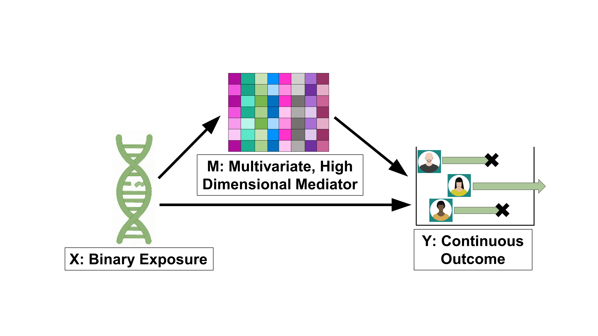

```{r, include = FALSE}
knitr::opts_chunk$set(
  collapse = TRUE,
  comment = "#>"
)
```

```{r setup}
library(bioPDM)
library(ggplot2)


```


\section*{Abstract}

bioPDM is a downstream omics analysis method that uses mediation to explore the causal pathway between an exposure and an outcome through high dimensional, multivariate omic data. The goal of bioPDM is to provide a method to perform mediation analysis on omic data where $p >> n$. The overall objective is to find groups of biological features, or principal directions of mediation (PDM) that mediate the effect of an exposure on a phenotype of interest.


\tableofcontents


\section{1. Mediation Overview}

First introduced by Baron and Kenny, a mediation model seeks to identify the underlying mechanism between an exposure and outcome through a third variable, known as the mediator. Mediation aims to decompose the total effect the exposure has on an outcome into the indirect effect and the direct effect. In an unmediated model, the exposure has a total effect, $c$, on the outcome (Figure 1). However, in a mediated model the total effect is decomposed into the direct effect and indirect effect. Not only does the exposure have the direct effect, $c’$, on the outcome, but it also has an indirect effect, $ab$, on the exposure through the mediator (Figure 1). 


\section{2. bioPDM Overview}


\subsection{2.1 Workflow}

bioPDM is a downstream analysis method for multivariate, omic data adapted from Geuter et al 2020. It assumes the user has an exposure $X$, a phenotype $Y$, and multivariate omic data $M$ measured on the same subjects. bioPDM assumes the omic data $M$ is high dimensional where $p >> n$, where $p$ is the number of features and $n$ is the number of subjects.  Figure 2 displays a visual representation of the causal assumptions between $M$, $X$, and $Y$ data. The goal of bioPDM is to find $q$ number of principal directions of mediation ($PDM$s) that each represent a weighted group of biological features that independently mediate the effect of $X$ on $Y$. bioPDM finds the weights $w_{jk}$ that maximize the indirect effect $|a_k b_k |$ between $X$ and $Y$ through $M$, under some constraints (Equation 1). 

<br> 

\[
PDM_{ik} = \sum_{j=1}^{p} M_{ij} w_{jk} \quad \textrm{for} \quad i=1,...n \quad \textrm{and} \quad k=1,...q
\]
\begin{equation}
  PDM_{ik} = a_{0k} + a_k X_i + \epsilon_1 
\end{equation}
\[
Y_i = b_{0k} + c'_k X_i + b_k PDM_{ik} + \epsilon_2 
\]
\[
\textrm{Find } w_k\quad\textrm{that maximizes }|a_k b_k| \quad s.t.\quad w^T_k w_k = 1\quad \textrm{and } w_k^T w_l = 0 \quad \textrm{where } l = 1,...k-1
\]

<br>

Each $PDM$ independently mediates the effect between the exposure $X$ and the phenotype of interest $Y$. The $w_1$ weights are found to maximize $|a_1 b_1 |$ while subsequent weights maximize $|a_k b_k |$ with the condition of being orthogonal to previous weights. Figure 3 displays a visual representation of the causal relationship between the data after the $PDM$s have been calculated. The general workflow for bioPDM (Figure 4) involves three steps: 

* **Step 1:** Reduce the dimensions of $M$. Dimension reduction is performed on the mediator data using singular value decomposition such that $M = \tilde{M} D$ where $\tilde{M}$ represents the mediator with a smaller dimension space and $D$ represents the weight matrix to map the reduced dimension space back to the original space. $\tilde{M}$ contains $b$ number of features where $b < n << p$. 

* **Step 2:** Calculate the $PDMs$ 

  + **a.** $PDM_1$ is calculated by finding the $w_1$ that maximizes the indirect effect $|a_1 b_1|$.
  
  \[
  PDM_{i1} = \sum_{j=1}^{b} \tilde{M_{ij}} w_{j1}
  \]
  \[
  PDM_{i1} = a_{01} + a_1 X_i
  \]
  \[
  Y_i = b_{01} + c'_1 X_i + b_1 PDM_{i1}
  \]
  \[
  \textrm{Find } w_1\quad\textrm{that maximizes }|a_1 b_1|\quad s.t.\quad w^T_1 w_1 = 1
  \]
  
  + **b.** Repeat ($q$ - 1) times where q is the number of $PDM$s to be calculated. 
  
  \[
  PDM_{ik} = \sum_{j=1}^{b} \tilde{M_{ij}} w_{jk}
  \]
  \[
  PDM_{ik} = a_{0k} + a_k X_i
  \]
  \[
  Y_i = b_{0k} + c'_k X_i + b_k PDM_{ik}
  \]
  \[
  \textrm{Find } w_k\quad\textrm{that maximizes }|a_k b_k|\quad s.t.\quad w^T_k w_k = 1\quad \textrm{and } w_k^T w_l = 0 \quad \textrm{where } l = 1,...k-1
  \]
    
  + **c.** Map weights back to the original mediator feature space using $D$ found in Step I in order to understand which biological features are contributing the most to each $PDM$. 

  \[
  M = \tilde{M} D \rightarrow \tilde{M} = M D^{-1}
  \]
  \[
  \therefore \tilde{M}_{ij} = \sum_{z=1}^{p} M_{iz} D^{-1}_{jz}\quad\textrm{where } j = 1,...b
  \]
  \[
  \therefore PDM_{ik} =  \sum_{j=1}^{b} (\sum_{z=1}^{p} M_{iz} D^{-1}_{jz})w_{jk}
  \]
  
  + **(Optional) d.** Calculate the $JointPDM$. $JointPDM$ is a weighted combination of all calculated $PDM$, where each $PDM$ is weighted by its accompanying indirect effect size. This allows the user to understand the global role each biological feature has on the mediation between $X$ and $Y$ in addition to the role it plays in each individual $PDM$. 
  
  \[
  W_{joint} = \sum_{k=1}^{q} (a_k b_k)w_{jk} \quad\textrm{where } q = number of PDMs
  \]
  \[
  JointPDM_i = \sum_{j=1}^{b} (\sum_{z=1}^{p} M_{iz} D^{-1}_{jz})W_{joint}
  \]
  
* **Step III:** Visualize the results by displaying a formatted table or a plot of the mediation path coefficients ($a_k, b_k, a_kb_k, c'_k$) for each $PDM$

  
\subsection{2.2 Package}

The bioPDM package has the following dependencies: doParallel, parallel, graphics, pracma, R.utils, and stats. The bioPDM package includes 4 exported functions: 

* **reduceMedDimension():** Reduces the dimensions of the high dimensional, omic mediator space using singular value decomposition (SVD)

* **getDirectionsOfMed():** Calculates principal directions of mediation ($PDM$s) that mediate the effect of a exposure on outcome

* **plotMedPathCoeff():** Plots the mediation path coefficients of $a_k$, $b_k$, and |$a_kb_k$|

* **printMedPathCoeff():** Prints mediation path coefficients in a formatted table 

More details on the functions can be found in the package function manual. 


```{r, echo=FALSE, warning = FALSE,out.width = '100%', fig.align = 'center', fig.cap= "bioPDM uses high dimensional mediation analysis to explore the pathway between an exposure on an outcome through a mediator. In a mediated model, the total effect, c, an exposure has on an outcome is decomposed into an indirect effect, a*b, and direct effect, c’."}

```

```{r, echo=FALSE, warning = FALSE, out.width = '100%', fig.cap= "Visual representation of the causal relationship between X, M, and Y", fig.align='center'}


```

```{r, echo=FALSE, warning = FALSE, out.width = '100%', fig.cap= "Visual representation of the causal relationship between the data after the PDMs have been calculated.", fig.align='center'}


```

```{r, echo=FALSE, warning = FALSE, out.width = '100%', fig.cap= "Workflow for bioPDM to calculate principal directions of mediation (PDM). X is the exposure, Y is the phenotype of interest outcome, and M is high dimensional omic mediator.", fig.align='center'}


```

\section{3. bioPDM workflow with a synthetic dataset}

\subsection{3.1 Synthetic dataset}

It is important to note that the methods developed can be used on many multivariate, high dimensional data sets. However, to explore the basic utilization of bioPDM, we consider a synthetic dataset with 1046 radiomic features ($M$), IDH mutation status ($X$), and survival outcome ($Y$) measured on 100 subjects. Radiomic features are centered and scaled. Survival outcome is reported as martingale residuals. 

  
```{r}
# Load data
df <- read.csv("vignette_data.csv")

# Specify the exposure (X), the outcome (Y), and the mediator (M)
X <- as.numeric(df$IDH)
Y <- df$martin
M <- dplyr::select(df, -IDH, -martin)

# Display the summary statistics of Y 
summary(Y)

# Display table of X values 
table(X)
# Show snapshot of the first 6 radiomic features 
head(M[,1:6])
```

\subsection{3.2 Step I: Reduce Dimensions}

The first step in bioPDM is to reduce the dimension space of the mediator using singular value decomposition (SVD) such that $M$ = $\tilde{M} D$ has $b$ number of dimensions and $b < n << p$. The default parameter value is to pick $b$ number of dimensions that explain 90% of mediator data variance. The output list containing $X$, $Y$, $\tilde{M}$, and $D$ will be used in the next step. 

```{r, cache = TRUE}

## Reduce the dimensions of M
reduced_mediator <- bioPDM::reduceMedDimension(treatment = X, outcome = Y, mediator = M)
```


\subsection{3.3 Step II: Find PDMs}

Step II uses the output from Step I as input for getDirectionsOfMed() function to calculate the $PDM$s. This function allows the user to determine how many $PDM$s to calculate, if $JointPDM$ should be calculated, if a bootstrapping step should occur, and if the results should be saved to a specified directory. Parallel computing is also optional to allow for faster compute time. More details on the inputs and outputs of getDirectionsOfMed() can be found in the package function manual. 

\subsubsection{Example 1: Default Parameter Values}

The default parameter values for getDirectionsofMed() include calculating 5 $PDM$s, calculating the $JointPDM$, not performing a bootstrapping step, and not saving the results.

```{r, cache = TRUE}
# Run getDirectionsOfMed() with default parameter values 
ex1_output <- bioPDM::getDirectionsOfMed(data_list = reduced_mediator, nPDM = 2)
```

The ex1_output is a list that includes feature weights, the mediation path coefficients, $a, b, c, c'$, for each $PDM$, all computed $PDM$s, and $JointPDM$. Sections 3.4 and 3.5 show different ways to interact with and display output results. 

\subsubsection{Example 2: Bootstrapping Option}

getDirectionsofMed() also includes an option to bootstrap. The bootstrapping step bootstraps the data with replacement, calculates the $w_{jk}$ weights for each bootstrapped sample, and calculates the 95% confidence interval (CI), mean, and standard deviation of the bootstrapped $w_{jk}$ weights.  

For the sake of this example, the first 2 $PDM$s are calculated and 50 samples are bootstrapped. However, the default parameter value for bootstrapped samples is 1000. 

```{r, cache = TRUE}
# Run getDirectionsOfMed() with bootstrapping 
# Bootstrap the first 2 PDMs with 100 samples
# Do not calculate the JointPDM 
ex2_output <- bioPDM::getDirectionsOfMed(data_list = reduced_mediator, nPDM = 2,
                doJointPDM = FALSE, doBootPDM = TRUE, bootSamp = 50)
```

The output list now includes an additional element named Boot. This element is a list that includes the 95% CI, mean, and standard deviation of bootstrap results for each feature weight for each $PDM$. The following code block displays how the user can interact with the bootstrapping results. 

```{r}
# What are the bootstrapped weight statistics (CI, mean, standard deviation) for feature 1 in PDM1?
ex2_output$Boot$featWeightStats$pdm_1$feat_1
```

\subsubsection{Example 3: Saving Outputs}

Finally, there is an option to save your outputs. The user is required to set the folder for which the output files will be saved to. The saveResults = TRUE parameter value will automatically create a 'bioPDM_results' folder to save all results to. It then creates a new folder with the folder name corresponding to the date and time that getDirectionsOfMed() function was executed. The output list from getDirectionsOfMed() is saved as well as a text file that includes the number of $PDM$s calculated and the number of bootstrapped samples (if applicable). Additionally, there is an optional parameter to include free text notes into the file (Figure 5). 

```{r, cache = TRUE}
# Run getDirectionsOfMed() and save results 

# Specify the directory to save results to
dir_to_save <- "~/"

# Optional Parameter of free text notes
free_text <- "Using synthetic dataset, executed bioPDM as an example for vignette"

ex3_output <- bioPDM::getDirectionsOfMed(data_list = reduced_mediator, nPDM = 3,
                saveResults = TRUE, saveDir = dir_to_save, notes = free_text)

```

```{r, echo=FALSE, warning = FALSE, out.width = '100%', fig.cap= "Example of the text file that gets saved with the output from getDirectionsOfMed() function when saveResults = TRUE", fig.align='center'}


```


\subsection{3.4 Step III: Display Results}

The final step of bioPDM allows for the visualization of the mediation path coefficients corresponding to each calculated $PDM$ by using the output from Step II. There is a function to make a plot of the coefficients to understand how each mediation path coefficient changes with each passing $PDM$. There is also a function to print the path coefficients in a formatted table for easy viewing. In the following examples, the path coefficient values from Example 1 are displayed. 

\subsubsection{Example: Plot Mediation Coefficients}


```{r, cache = TRUE}
# Plot mediation path coefficients
bioPDM::plotMedPathCoeff(ex1_output$pathCoeff) 
```


\subsubsection{Example: Print Mediation Coefficients}

```{r, cache = TRUE}
# Print mediation path coefficients
bioPDM::printMedPathCoeff(ex1_output$pathCoeff) 
```

\subsection{Interpreting Mediation Path Coefficients}

The mediation path coefficients compare the strength of the indirect effects, specifically the strength of the effect of exposure on the PDMs and the strength of the effect of the PDMs on the outcome. Recall that the exposure in our example is an IDH gene mutation with $X = 0$ representing wild type and $X = 1$ representing a gene mutation. Also recall that the outcome of interest is martingale residuals where positive values mean the patient died sooner than expected. 

When there is a positive $a$ coefficient, higher PDM values are associated with the gene mutation since IDH wild type has a value of 0 and IDH mutation has a value of 1. Where there is a positive $b$ coefficient, the PDM values have a positive relationship with martingale residuals. Therefore, higher PDM values are associated with the patient dying sooner than expected. 

\subsection{3.5 Additional Ways to Interact with bioPDM Results}

\subsubsection{Example: Plot PDM1 vs PDM2}

```{r}
# Plot PDM1 vs PDM2 using ggplot package

# Make a data frame that includes 
plot_df <- data.frame(X, PDM1 = ex1_output$PDM1 , PDM2 = ex1_output$PDM2)

# Plot PDM1 vs PDM2
# Subject color corresponds to their X values (IDH status)
ggplot2::ggplot(plot_df, aes(x=PDM1, y=PDM2, col = as.factor(X))) + geom_point(size = 3) +  
  scale_color_manual(values=c("#FA573C", "#000000"), labels = c('WT', 'Mutation')) +
  labs(color = "IDH Status")+
  theme(axis.title=element_text(size=20))
```

\subsubsection{Example: What features contribute the most to PDM1?}

```{r}
# What features contribute the most to PDM1?

# Make a data frame that includes the radiomic feature names
# And the absolute value of the feature weights
PDM1_weights <- data.frame(features = names(M), w_k = abs(ex1_output$featWeights[[1]]))

# Sort by weight values in decreasing order
PDM1_weights <- PDM1_weights[order(-PDM1_weights[,2]), , drop = FALSE]  

# Display the top 6 radiomic features that contribute the most to PDM1
head(PDM1_weights)
```

\section*{References}

Geuter, Stephan, et al. “Multiple Brain Networks Mediating Stimulus–Pain Relationships in Humans.” *Cerebral Cortex*, vol. 30, no. 7, 2020, pp. 4204–4219., https://doi.org/10.1093/cercor/bhaa048. 


Baron, R.M. and D.A. Kenny, The moderator-mediator variable distinction in social psychological research: conceptual, strategic, and statistical considerations. J Pers Soc Psychol, 1986. 51(6): p. 1173-82


